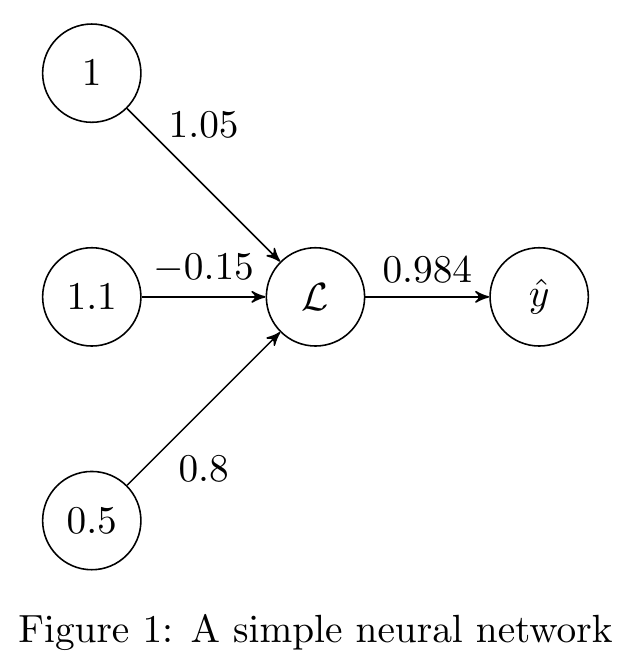
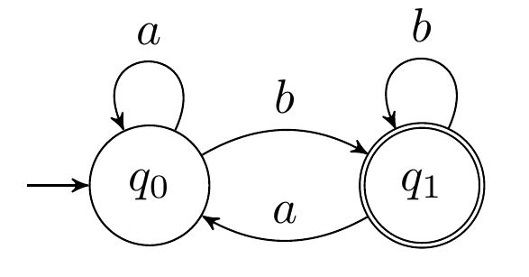

# TikzGraph

This is a C# library designed to generate code for graph plots for LaTeX documents.

## Table of contents

- [TikzGraph](#tikzgraph)
  - [Table of contents](#table-of-contents)
  - [Usage](#usage)
  - [Planned Refactors](#planned-refactors)
  - [Planned Implementations](#planned-implementations)
  - [Potential Implementations](#potential-implementations)

## Usage

As an example, observe the following graph:



In LaTeX, it is made from the following code:

```latex
\usepackage{tikz}
\usetikzlibrary{automata, positioning, arrows}

\begin{figure}
  \centering
    \begin{tikzpicture}
        \node[state] (b) {$1$};
        \node[state, below of=b] (x1) {$1.1$};
        \node[state, below of=x1] (x2) {$0.5$};
        \node[state, right of=x1] (L) {$\mathcal{L}$};
        \node[state, right of=L] (y) {$\hat{y}$};

        \draw (b) edge[above] node[yshift=3mm] {$1.05$} (L)
              (x1) edge[above] node[] {$-0.15$} (L)
              (x2) edge[below] node[yshift=-3mm] {$0.8$} (L)
              (L) edge[above] node[] {$0.984$} (y)
        ;
    \end{tikzpicture}
  \caption{A simple neural network}
  \label{fig:simple_nn}
\end{figure}
```

The above code, excluding the package usages, is generated using this library from the following:

```cs
var inputNodeB = new TikzNode("b", "1");
var inputNodeX1 = new TikzNode("x1", "1.1");
var inputNodeX2 = new TikzNode("x2", "0.5");

var NodeL = new TikzNode("L", @"\mathcal{L}");
var NodeY = new TikzNode("y", @"\hat{y}");

var edgeBL = new TikzEdge("1.05", yShift: 3);
var edgeX1L = new TikzEdge("-0.15");
var edgeX2L = new TikzEdge("0.8", textDirection: Direction.Below, yShift: -3);
var edgeLY = new TikzEdge("0.984");

var figure = new TikzFigure("A simple neural network", "simple_nn", inputNodeB);

figure.AddNode(inputNodeX1, inputNodeB, Direction.Below);
figure.AddNode(inputNodeX2, inputNodeX1, Direction.Below);

figure.AddNode(NodeL, inputNodeX1, Direction.Right);
figure.AddNode(NodeY, NodeL, Direction.Right);

figure.AddEdge(edgeBL, inputNodeB, NodeL);
figure.AddEdge(edgeX1L, inputNodeX1, NodeL);
figure.AddEdge(edgeX2L, inputNodeX2, NodeL);
figure.AddEdge(edgeLY, NodeL, NodeY);

var tikz = figure.Build();
Console.WriteLine(tikz);
```

## Planned Refactors

- Simplify edge-node relationships. The current code hard-coded and too explicit.
  Must implement visitor pattern and other design patterns to allow for a more dynamic design.
- Proposed coding semantic:
  
  ```cs
  var nodeA = new Node();
  var nodeB = new Node();
  var nodeC = new Node();

  figure = new Figure(nodeA);

  // Attach edges via extensions
  nodeA.SharesEdgeWith(nodeB)
       .WithProperties( /* Edge properties*/ );

  // Can return edge object reference     
  var edgeAC = nodeA.SharesEdgeWith(nodeC);

  figure.Build();
  ```

## Planned Implementations

- Support edge styling options. e.g. specify arrows `'<->'`, `'->'`, `'<-'`, and `'-'`.
- Support self-loops / edges to self, along with the appropriate styling options.
- Suggest appropriate package usages. e.g. `\usetikzlibrary{automata, positioning, arrows}` when they are required to generate the required figure. Proposed implementation:
  
  ```cs
  [RequiredTikzPackage("arrows")]
  public static class SomeArrowClass
  {
    [RequiredTikzPackage("arrows.meta")]
    public static void SomeArrowClassMethod()
    {
      /* Code */
    }
  }
  ```

  This proposed change will use reflection to determine what packages are required when calling `TikzFigure.Build()`.

## Potential Implementations

- Extensions to construct figures using formal definitions for Autonoma.

  One such definition would be `M=(K, Σ, δ, s, A)`, which relates to the [Finite State Machine](https://en.wikipedia.org/wiki/Finite-state_machine). Or, more specifically, the [Deterministic Finite State Machine](https://en.wikipedia.org/wiki/Deterministic_finite_automaton).

  An example implementation may be the following, which is a DFSM that accepts a string ending in `"b"` from the alphabet `{"a", "b"}`:

  ```cs
  var q0 = new Node("q0");
  var q1 = new Node("q1");

  var K = new[] { q0, q1 };

  var sigma = new[] { "a", "b" };

  var s = q0;
  var A = new[] { q1 };

  var delta = new List<FsmTransition>();
  delta.Add(new (q0, "a", q0));
  delta.Add(new (q0, "b", q1));
  delta.Add(new (q1, "a", q0));
  delta.Add(new (q1, "b", q1));

  var figure = Figure.FromFormalDefinition(K, sigma, delta, s, A)
  figure.Build();
  ```

  This example would produce code to build the following Autonoma:

  

  Pre-requisite implementation would be auto-formatting for elements such as node directions and edge bend directions (unless somehow given). It may be incredibly difficult to construct something perfect; However, an imperfect model would suffice, but would require the user to make alterations.
