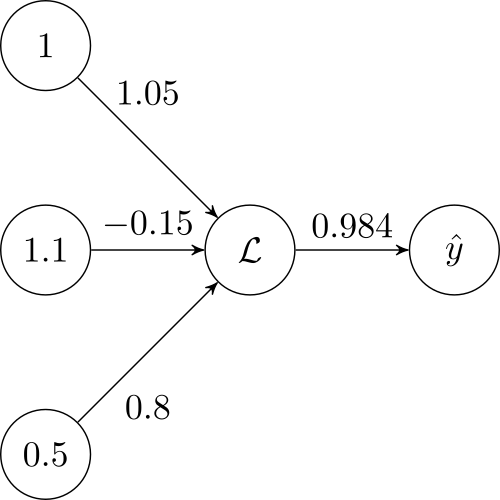

# Introduction

## Building a simple figure

In this tutorial, we will aim to build a very small and simple neural network-like figure.
Observe the final result:



There are three objects we will use to construct the above image: `Node`, `Edge`, and `Figure`. 

## Nodes

The [TikzNode](xref:TikzAutonoma.TikzObjects.TikzNode) object allows us to encapsulate our node data and reuse it with ease.
We need to make four nodes, each with their own names and labels. The name corresponds to the property PGF uses to render the Tikz figure. The label is the contents of the node. We can compare the C# object and LaTeX code with this example:

- C#:

```cs
var myNode = new TikzNode("nodeName", "node label");
```

- LaTeX:

```latex
\node[state] (nodeName) {$node label$};
```

We can, of course, remove the `$` from the node label, rendering it as plain text rather than a math environment with an extra parameter in our node constructor:

```cs
var myNode = new TikzNode("nodeName", "node label", textMode: TextMode.PlainText);
```

Here, the `textMode` optional parameter [](xref:TikzAutonoma.TextMode). We can now begin building our diagram. We will name each node based on their job role in the figure. The left-most input layer, from top to bottom, will be the bias, input 1, and input 2. We will simply call there `inputNodeB`, `inputNodeX1`, and `inputNodeX2`:

```cs
var inputNodeB = new TikzNode("b", "1");
var inputNodeX1 = new TikzNode("x1", "1.1");
var inputNodeX2 = new TikzNode("x2", "0.5");
```

The second layer has a node representing a node with an "activation function". In LaTeX, we can write this fancy L with `\mathcal{L}`. The third layer, the output layer, also has a node with a label with an accent. This "hat" is given with: `\hat{y}`. Note that both of these nodes require the math environment, so we will not use plaintext here:

```cs
var NodeL = new TikzNode("L", @"\mathcal{L}");
var NodeY = new TikzNode("y", @"\hat{y}");
```

That is all for the nodes of this figure. Simple!

## Edges

The [TikzEdge](xref:TikzAutonoma.TikzObjects.TikzEdge) object is also very simple. Unlike nodes, edges have no name. There are still arguments we can give, however, which will affect the way our figure will be styled. Namely, the `xshift`, `yshift`, and `textDirection` arguments. For edges, these arguments shift the location of the text label!

```cs
var edgeBL = new TikzEdge("1.05", yShift: 3);
var edgeX1L = new TikzEdge("-0.15");
var edgeX2L = new TikzEdge("0.8", textDirection: Direction.Below, yShift: -3);
var edgeLY = new TikzEdge("0.984");
```

> [!NOTE]
> Currently, there is no implementation for loops from a node to itself. Nor is there edge bending. These are planned features.

In the example we are working on, the subtle style changes such as the shifting can easily be ignored and added into the final LaTeX generated code. However, for larger figures, where you may be constantly re-generating figures, it may be helpful to spent a little more time to just add the properties as you go.

We are now half way there! All that is left is to add these objects to a figure and then build!

## Figure

Currently, you must provide a caption and a figure name for the [TikzFigure](xref:TikzAutonoma.TikzObjects.TikzFigure).

```cs
var figure = new TikzFigure("A simple neural network", "simple_nn", inputNodeB);
```

Our final step is to hook up each edge to a source node and a target node:

```cs
figure.AddNode(inputNodeX1, inputNodeB, Direction.Below);
figure.AddNode(inputNodeX2, inputNodeX1, Direction.Below);

figure.AddNode(NodeL, inputNodeX1, Direction.Right);
figure.AddNode(NodeY, NodeL, Direction.Right);

figure.AddEdge(edgeBL, inputNodeB, NodeL);
figure.AddEdge(edgeX1L, inputNodeX1, NodeL);
figure.AddEdge(edgeX2L, inputNodeX2, NodeL);
figure.AddEdge(edgeLY, NodeL, NodeY);
```

That is it! We can now generate our figure:

```cs
var tikz = figure.Build();
Console.WriteLine(tikz);
```

The outputted result is given:

```latex
\begin{figure}
  \centering
    \begin{tikzpicture}
        \node[state] (b) {$1$};
        \node[state, below of=b] (x1) {$1.1$};
        \node[state, below of=x1] (x2) {$0.5$};
        \node[state, right of=x1] (L) {$\mathcal{L}$};
        \node[state, right of=L] (y) {$\hat{y}$};

        \draw (b) edge[above] node[yshift=3mm] {$1.05$} (L)
              (x1) edge[above] node[] {$-0.15$} (L)
              (x2) edge[below] node[yshift=-3mm] {$0.8$} (L)
              (L) edge[above] node[] {$0.984$} (y)
        ;
    \end{tikzpicture}
  \caption{A simple neural network}
  \label{fig:simple_nn}
\end{figure}
```
